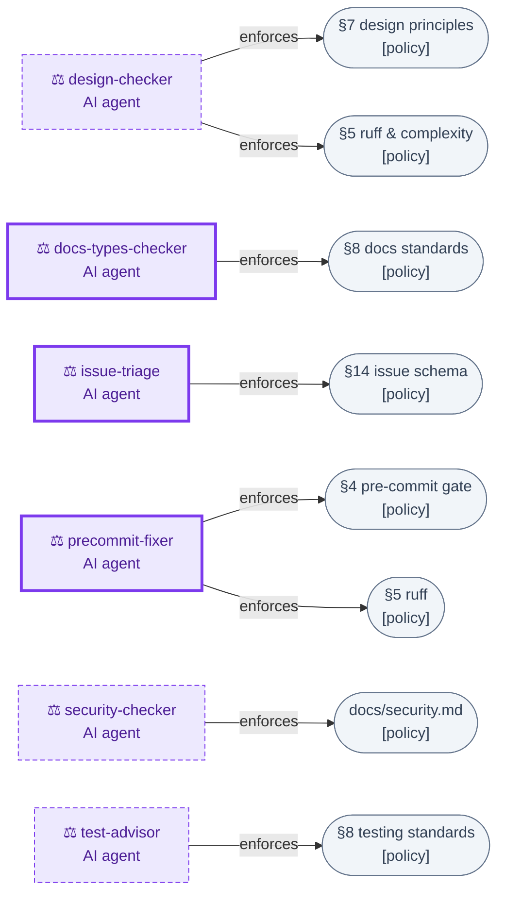
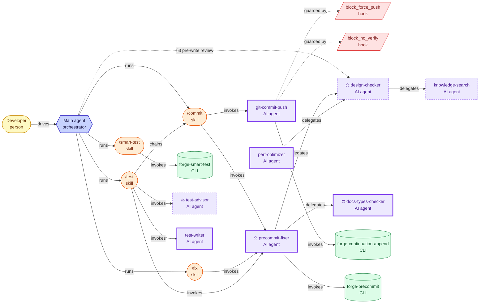
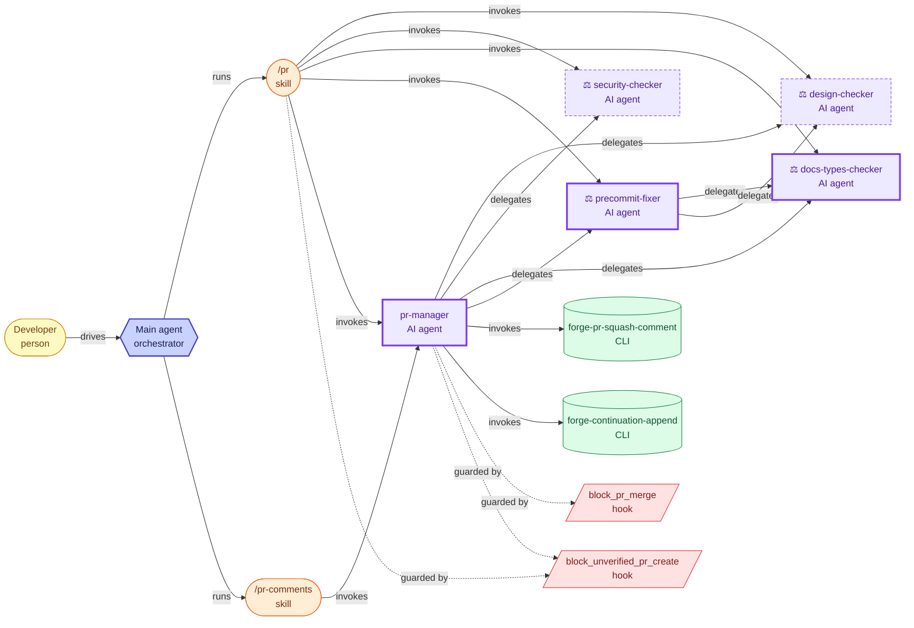
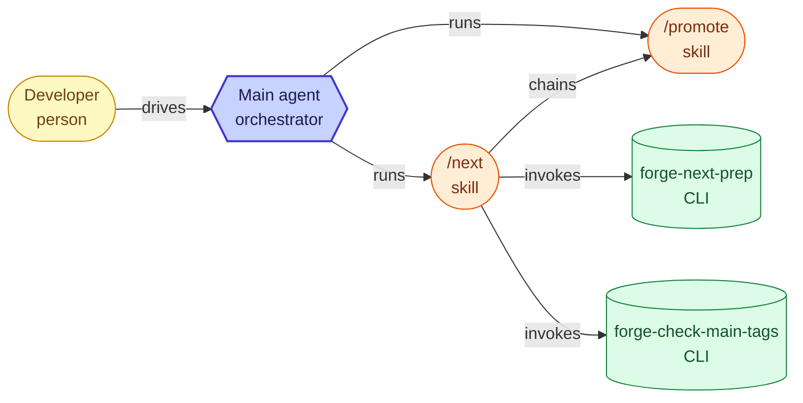
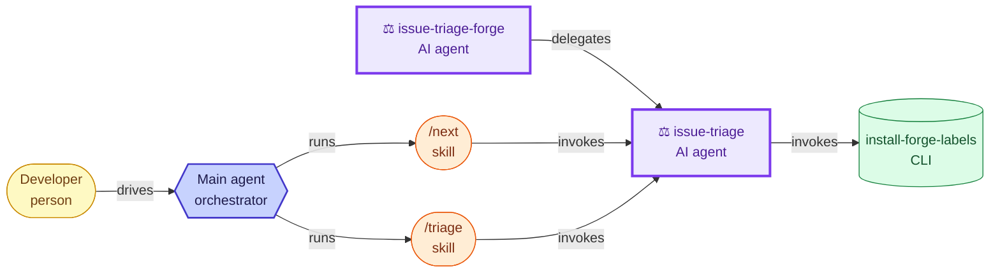
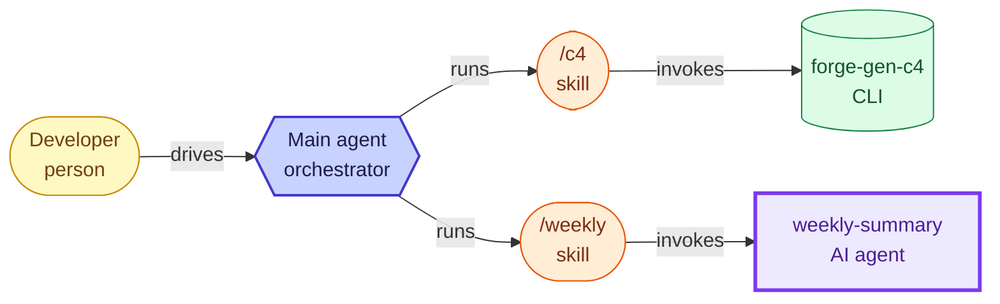
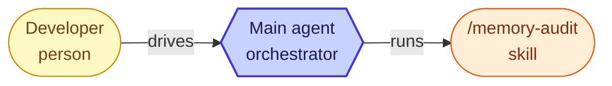

# Forge agent architecture

> **Maintained by hand, guarded by a check.** Nodes (agents / skills / hooks /
> CLIs) are discovered from the repo; edges, phases, and enforcer badges are
> hand-curated and source-verified. Two layers keep it honest: the `agent_doc`
> pre-commit step gates node **coverage + no dangling refs** on every commit,
> and at PR review `docs-types-checker` runs `verify-forge-agent-doc --diff
> <base>` to surface the **edge** changes a PR made so they get reconciled
> here. Still eyeball it when `agents/`, `skills/`, or `claude-hooks/` change.

How forge's AI **subagents** interact with the **skills** that invoke them,
the **hooks** that guard them, and the deterministic **CLIs** they drive —
all orchestrated by the **main agent** the developer talks to. The fleet is
sliced into workflow-phase subviews so each stays readable.

> Auto-derived nodes (agents/skills/hooks/CLIs discovered from the repo) +
> hand-curated, source-verified edges. Regenerate alongside the README's link.

## How to read these diagrams

- **Node kind (colour):** 🟨 person · 🟦 main agent · 🟪 AI agent · 🟧 skill ·
  🟥 hook · 🟩 CLI · ⬜ policy (FOUNDATION §)
- **Agent border:** *dashed* = **reporter** (read-only, no `Write`/`Edit`) ·
  *thick* = **mutator** (writes files or git/GitHub state)
- **Badge:** ⚖️ = **FOUNDATION-enforcer** — an agent whose primary job is to
  *verify or remediate* compliance with a rule (not merely follow it)
- **Edge:** `──▶` solid = a wired call / delegation ·
  `╌╌▶` dotted = a **FOUNDATION guideline** the main agent is told to follow
  (e.g. §3 "review before editing") but which **no skill actually wires**

## ⚖️ FOUNDATION-enforcers (cross-cutting)

The agents whose job is compliance, and the rules they enforce.

## Design & Development

## Review

## Release

## Backlog

## Docs & Reporting

## Maintenance

